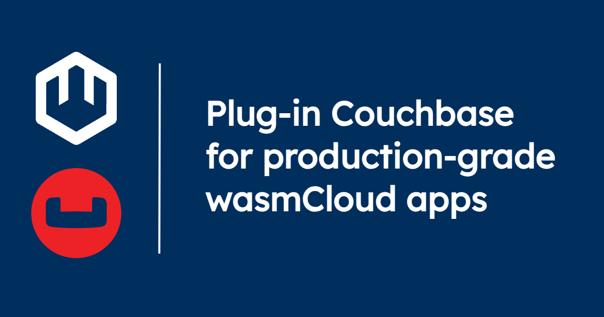

[wasmCloud](/docs/intro) enables developers to build applications out of WebAssembly components and pluggable [**capabilities**](/docs/concepts/capabilities): a modular design philosophy that puts the focus on problem-solving and abstracts away boilerplate. When you build an application with wasmCloud, you can swap out requirements like databases or key-value stores without ever making changes to business logic. 

[Couchbase](https://docs.couchbase.com/home/index.html) is a popular distributed document database for enterprise applications. With the Couchbase wasmCloud capability, you can easily plug Couchbase in to your wasmCloud application (regardless of the language you're working in) to back key-value operations in production. 

In this post, you'll learn how to use the Couchbase capability in your wasmCloud apps.

## Plug in your Couchbase

Capabilities are created through the combination of **interfaces** and **providers**. 

* Interfaces provide a common API for the underlying functionality&mdash;an API (defined in [WebAssembly Interface Type (WIT)](/docs/concepts/interfaces#webassembly-interface-type-wit)) that can be utilized by all the different pieces of an application, regardless of the language they're written in. 
* Providers are executable plugins that actually *back* the interface and provide the functionality represented in the API.

Interfaces can be very wide in scope (like "[**HTTP**](https://github.com/WebAssembly/wasi-http)" or "[**logging**](https://github.com/WebAssembly/wasi-logging)") or comparably narrow, like [Postgres](https://github.com/wasmCloud/wasmCloud/tree/main/wit/postgres) or [Couchbase](https://github.com/couchbaselabs/wasmcloud-provider-couchbase/tree/main/wit/couchbase). There are advantages to both approaches; a more widely-scoped interface enables developers to use a wider range of underlying technologies, but may necessarily sacrifice some of the singular features of each. A more focused interface can take advantage of the specific capabilities of a given tool in a more granular way. 

Either way, a common, language-agnostic interface makes the provider **pluggable** and **reusable**.

The Couchbase KV capability delivers Couchbase key-value connectivity for any wasmCloud application, using the [`wasmcloud:couchbase`](https://github.com/couchbaselabs/wasmcloud-provider-couchbase/tree/main/wit/couchbase) interface and the [Couchbase capability provider](https://github.com/couchbaselabs/wasmcloud-provider-couchbase/tree/main). Simply use the interface for your operations, plug the provider into your app, and you're ready to go. 

In the walkthrough below, we'll see the capability in action. 

## Get started with Couchbase on wasmCloud

In this walkthrough, we'll demonstrate the Couchbase KV provider working with both Rust-based and Go-based components (no need to be familiar with either language). Each of the components take a payload and path in order to roundtrip a JSON document in Couchbase. The demo will also use a wasmCloud secrets backend to help get a feel for how this might look in production. 

For this example, you'll need:

- The [wasmcloud Shell (`wash`)](https://wasmcloud.com/docs/installation) CLI 0.36.1+ to build WebAssembly components and deploy to local wasmCloud.
- [`cargo`](https://doc.rust-lang.org/cargo/getting-started/installation.html) (part of the Rust toolchain) to help build from Rust
- The [`secrets-nats-kv`](https://github.com/wasmCloud/wasmCloud/tree/main/crates/secrets-nats-kv) CLI (requires `cargo` above)
- [Go](https://go.dev/doc/install) 1.23.0+ and [TinyGo](https://tinygo.org/getting-started/install/) 0.33.0+ for the Go component
- [`docker`](https://docs.docker.com) for running Couchbase.

### Start Couchbase and wasmCloud locally

Clone the Couchbase provider repo:

```shell
git clone https://github.com/couchbaselabs/wasmcloud-provider-couchbase
```
```shell
cd wasmcloud-provider-couchbase
```

We'll use Docker Compose in this repo to start Couchbase. From your new `wasmcloud-provider-couchbase` directory:
```bash
docker-compose up -d
```

In another terminal tab, we'll start our local wasmCloud, using the `-d`/`--detached` flag to run in the background:

```shell
WASMCLOUD_SECRETS_TOPIC=wasmcloud.secrets \
    wash up -d
```

:::info[Reading logs]
When you run `wash up` in detached mode, you can find your logs at `~/.wash/downloads/wasmcloud.log`.
:::


Build the Couchbase provider:

```shell
wash build
```

Build the example components with:

```shell
wash build -p components/rust
wash build -p components/golang
```

### Deploy the application

Before we deploy, we'll generate encryption keys and run our secrets backend:

```shell
export ENCRYPTION_XKEY_SEED=$(wash keys gen curve -o json | jq -r '.seed')
```
```shell
export TRANSIT_XKEY_SEED=$(wash keys gen curve -o json | jq -r '.seed')
```
```shell
secrets-nats-kv run &
```

Now we'll use the `secrets-nats-kv` tool to put the password in the NATS KV secrets backend used by this application:

```shell
provider_key=$(wash inspect ./build/wasmcloud-provider-couchbase.par.gz -o json | jq -r '.service')
```
```shell
secrets-nats-kv put couchbase_password --string password
```
```shell
secrets-nats-kv add-mapping $provider_key --secret couchbase_password
```

And now we'll deploy the app:

```shell
wash app deploy ./wadm.yaml
```

Now we can invoke either the Rust component or the Golang component on port 8080 and 8081, respectively. Both components implement the exact same functionality, which simply takes a payload and a path to roundtrip a JSON document in Couchbase.

```shell
curl -d '{"demo": true, "couchbase": "db", "wasmcloud": "application platform"}' \
    localhost:8080/mykey
{"demo": true, "couchbase": "db", "wasmcloud": "application platform"}%
```

### Clean up

When you're done with the demo, you can delete the application from your local wasmCloud:

```shell
wash app delete couchbase
```
To stop the wasmCloud instance:

```shell
wash down
```

## Learn more and get involved

Check out the [wasmCloud Capability Catalog](/docs/capabilities/) to learn more about the capabilities you can plug in to any wasmCloud application. 

Ready to get involved? [Join us on the wasmCloud Slack](https://slack.wasmcloud.com/) to be part of the conversation and get tips on building your own components and capabilities.
